# SOTM Chapter 1 — Production Map Ownership and Startup Flow

**Date:** 28 July 2026  
**Milestone:** Stable project foundation  
**Scope:** Map ownership, startup routing, player possession, transition references, and cook inclusion only.

No AI, coin, objective, upgrade, boss, Timmy, or cutscene feature was implemented in this milestone. No asset was deleted.

## Production map decision

| Role | Production map | Decision evidence |
|---|---|---|
| Main Menu | `/Game/Main_Menu_Map` | Custom project map, one configured `BP_MenuSystemActor`, a menu camera, and `bLevelIsMainMenu=True`. It is no longer dependent on a startup redirector. |
| Mansion | `/Game/Mansion_GameStart` | Valid World Partition map with one PlayerStart, navigation, a menu-system actor, the existing forest transition trigger, and the strongest current gameplay-start composition. |
| Forest | `/Game/MenuSystemPro/ExampleContent/Designs/Design_Silence/Levels/CH1` | The only populated forest world: 865 loaded actors, including approximately 330 placed coins, 33 enemy actors, foliage, navigation volumes, one PlayerStart, and `BP_PlayLevelGameMode`. |
| Boss Arena | **Not selected yet** | No current map is a verified production boss arena. Selection/creation is intentionally deferred. |
| Ending | **Logical flow state; map TBD if required** | No ending map is currently connected. |
| Mansion Return | `/Game/Mansion_GameStart` | Reuse the authoritative mansion map with a future return checkpoint/state. |

Although the production forest remains inside a `MenuSystemPro/ExampleContent` path, it should **not** be moved during this foundation milestone. It is a World Partition map with hundreds of external actors. A later controlled migration would require redirector, external-package, cook, and save compatibility testing.

## Implemented startup contract

### Engine configuration

`Config/DefaultEngine.ini` now uses:

- `EditorStartupMap=/Game/Main_Menu_Map.Main_Menu_Map`
- `GameDefaultMap=/Game/Main_Menu_Map.Main_Menu_Map`
- `ServerDefaultMap=/Game/Main_Menu_Map.Main_Menu_Map`
- `GlobalDefaultGameMode=/Game/MenuSystemPro/Blueprints/GameFramework/BP_PlayLevelGameMode.BP_PlayLevelGameMode_C`
- `GameInstanceClass=/Game/MenuSystemPro/Blueprints/GameFramework/BP_MenuSystemGameInstance.BP_MenuSystemGameInstance_C`

### Main menu

`/Game/Main_Menu_Map` now explicitly uses:

- GameMode: `/Game/MenuSystemPro/Blueprints/GameFramework/BP_MenuLevelGameMode`
- PlayerController: `/Game/MenuSystemPro/Blueprints/Player/BP_MenuSystemPlayerController`
- Main-menu actor: `BP_MenuSystemActor`, `bLevelIsMainMenu=True`

The old map-specific `BP_MenuGameMode1` override was removed from this map. That GameMode used `AbilitySystemTestPawn` and was not appropriate for production.

### New Game

The active menu configuration asset:

`/Game/MenuSystemPro/ExampleContent/Designs/Design_Silence/Config/DA_GlobalMenuConfig`

now contains:

- `MenuLevel=/Game/Main_Menu_Map`
- `CreateNewGameLevel=/Game/Mansion_GameStart`

### Mansion player spawn

`/Game/Mansion_GameStart` now explicitly uses:

- GameMode: `/Game/MenuSystemPro/Blueprints/GameFramework/BP_PlayLevelGameMode`
- Default Pawn: `/Game/MenuSystemPro/Blueprints/Player/BP_MenuSystemCharacter`
- PlayerController: `/Game/MenuSystemPro/Blueprints/Player/BP_MenuSystemPlayerController`

The map has exactly one PlayerStart.

### Mansion to forest

The existing `TriggerBox` overlap in the `Mansion_GameStart` Level Blueprint still drives the transition. Its `Open Level (by Name)` target was changed from the redirector name `Demo` to:

`/Game/MenuSystemPro/ExampleContent/Designs/Design_Silence/Levels/CH1`

The Level Blueprint compiled and saved successfully after the change.

### Forest player spawn

`CH1` already has:

- GameMode: `/Game/MenuSystemPro/Blueprints/GameFramework/BP_PlayLevelGameMode`
- Default Pawn: `/Game/MenuSystemPro/Blueprints/Player/BP_MenuSystemCharacter`
- PlayerController: `/Game/MenuSystemPro/Blueprints/Player/BP_MenuSystemPlayerController`
- One PlayerStart

### Packaging inclusion

`Config/DefaultGame.ini` now explicitly cooks:

- `/Game/Main_Menu_Map`
- `/Game/Mansion_GameStart`
- `/Game/MenuSystemPro/ExampleContent/Designs/Design_Silence/Levels/CH1`

This is required because the mansion-to-forest Level Blueprint uses a name/path-based level transition.

## Gameplay flow diagram

```mermaid
flowchart LR
    Menu["Main Menu<br/>/Game/Main_Menu_Map"]
    Mansion["Mansion<br/>/Game/Mansion_GameStart"]
    Forest["Forest<br/>/Game/MenuSystemPro/.../Levels/CH1"]
    Boss["Boss Arena<br/>TBD — not implemented"]
    Ending["Ending + Credits<br/>TBD — not implemented"]
    Return["Mansion Return<br/>/Game/Mansion_GameStart<br/>future checkpoint state"]

    Menu -->|"New Game"| Mansion
    Mansion -->|"Existing transition trigger"| Forest
    Forest -.->|"Future boss entrance"| Boss
    Boss -.->|"Future victory event"| Ending
    Ending -.->|"Future return travel"| Return
```

Solid arrows were wired or verified in this milestone. Dashed arrows are the approved future flow only and have not been implemented.

## Verification results

| Check | Result |
|---|---|
| Clean editor restart opens the selected Main Menu | Passed: editor reopened `/Game/Main_Menu_Map`. |
| Main menu GameMode | Passed: `BP_MenuLevelGameMode`. The old `AbilitySystemTestPawn` GameMode no longer runs. |
| New Game configuration target | Passed: saved value resolves to `/Game/Mansion_GameStart`. |
| Main Menu → Mansion PIE travel | Passed from a clean editor session. |
| Mansion GameMode and possession | Passed: `BP_PlayLevelGameMode`, `BP_MenuSystemPlayerController`, and `BP_MenuSystemCharacter` spawned. |
| Mansion Level Blueprint forest path | Passed: the saved `Open Level` pin resolves to the production `CH1` package. |
| Mansion → Forest map travel | Passed in PIE during direct travel verification. |
| Forest GameMode and possession | Passed: `BP_PlayLevelGameMode`, `BP_MenuSystemPlayerController`, and `BP_MenuSystemCharacter` spawned. |
| Production-map asset validation | Passed for Main Menu, Mansion, and Forest packages. |
| Clean load with no warnings | **Not passed:** the mansion contains pre-existing missing environment dependencies; see Remaining Foundation Issues. |

One PIE test initially asserted while traveling into the mansion because the World Partition external packages had already been opened in the editor without PIE flags. After restarting Unreal and testing from the real startup map, Main Menu → Mansion travel succeeded. This remains an editor workflow hazard: travel tests should begin from a clean editor session until the external-actor/package warnings are repaired.

## Map inventory policy

The policy is **retain physically, ignore operationally**:

- Do not delete, rename, move, or fix redirectors yet.
- Only the three production maps above belong in the current startup/cook flow.
- Other maps remain available as source, comparison, marketplace demonstration, or recovery material.
- No non-production map should be referenced by New Game, gameplay travel, server startup, or `MapsToCook`.

## Duplicate and superseded project maps — retain but ignore

These are plausible project candidates or duplicates, but are not authoritative:

- `/Game/Mansion` — older mansion composition; superseded by `Mansion_GameStart`.
- `/Game/L10N/en/Mansion_GameStart` — localized duplicate; not the authoritative source world.
- `/Game/MenuSystemPro/ExampleContent/Designs/Design_Silence/Levels/Menu` — former startup target and marketplace-derived menu composition; superseded by `/Game/Main_Menu_Map`.
- `/Game/MenuSystemPro/ExampleContent/Designs/Design_Silence/Levels/Chapter1_Level` — large alternate Chapter 1 candidate; not the selected forest.
- `/Game/Levels/Chapter1_Forest` — small PCG/environment candidate; it does not contain the populated Chapter flow found in `CH1`.
- `/Game/Levels/Forest_Prototype` — landscape/PCG prototype; retain as reference or future developer test base.
- `/Game/MyLevel_metadatafix` — repair/metadata experiment.

## Map redirectors — retain but do not use in production routing

The asset registry identifies these `.umap` packages as World redirectors:

- `/Game/Chapter1_Forest` → `/Game/Levels/Chapter1_Forest`
- `/Game/Demo_Menu` → `/Game/MenuSystemPro/ExampleContent/Designs/Design_Silence/Levels/Demo_Menu`
- `/Game/Forest` → `/Game/MenuSystemPro/ExampleContent/Designs/Design_Silence/Levels/Forest`
- `/Game/Forest_Prototype` → `/Game/Levels/Forest_Prototype`
- `/Game/Untitled` → `/Game/Levels/Untitled` (destination is not present in the map inventory)
- `/Game/DarkForest/Maps/Chapter1` → `/Game/DarkForest/Maps/Demo`
- `/Game/DarkForest/Maps/Demo` → `/Game/MenuSystemPro/ExampleContent/Designs/Design_Silence/Levels/Demo`
- `/Game/DarkForest/Maps/Demo_Menu` → `/Game/MenuSystemPro/ExampleContent/Designs/Design_Silence/Levels/Demo_Menu`
- `/Game/Forest/Maps/Demo` → `/Game/Forest/Maps/Forest`
- `/Game/Forest/Maps/Forest` → `/Game/Forest`
- `/Game/MenuSystemPro/ExampleContent/Designs/Design_Silence/Levels/Demo` → production forest `CH1`
- `/Game/MenuSystemPro/ExampleContent/Designs/Design_Silence/Levels/Demo_Menu` → marketplace-derived `Menu`
- `/Game/MenuSystemPro/ExampleContent/Designs/Design_Silence/Levels/Forest` → `Demo` → production forest `CH1`
- `/Game/MenuSystemPro/ExampleContent/Designs/Design_Silence/Levels/Mansion` → `/Game/Mansion`
- `/Game/SuperPowers/StarterContent/MansionAssets/MansionAssets` → missing/non-inventory `/Game/StarterContent/Mansion/MansionAssets`
- `/Game/Victorian_Hotel/NewWorld` → `/Game/Victorian_Hotel/Map/Lvl_Demo`
- `/Game/Video/NewWorld` → `/Game/Video/Scene1`

Production routing now bypasses all of these redirectors.

## Invalid or unregistered map packages — retain for forensic review, never route to them

- `/Game/SuperPowers`
- `/Game/SuperPowers/SuperPowers`

Both were reported as invalid package files during the audit and are not registered as World assets.

## Marketplace/example maps — retain but ignore

### AI, character, VFX, and presentation samples

- `/Game/AI/CruelDoll/Maps/MAP_AnimationsOverview`
- `/Game/AI/CruelDoll/Maps/MAP_CharacterOverview`
- `/Game/DashVFX/Levels/DemoMap_Dash`
- `/Game/HorrorBear/Maps/HorrorBear`
- `/Game/Mage/Maps/MAP_Mage_Presentation`
- `/Game/Magic_Explosion/Demo/DemoMap`
- `/Game/MilitaryWeapDark/Overview`
- `/Game/Spider/map/Spider`
- `/Game/SuperPowers/Maps/SuperPowers_Map`
- `/Game/ThirdPerson/Maps/ThirdPersonMap`

### Forest/environment showcase maps

- `/Game/DarkForest/Maps/Demo_Day`
- `/Game/Forest/Maps/Overview`
- `/Game/Forestglade/Maps/Overview`
- `/Game/Forestglade/Maps/Showcase`
- `/Game/ForestSet/Maps/Overview`
- `/Game/ForestSet/Maps/Showcase`
- `/Game/FreeFurniturePack/Maps/Overview`
- `/Game/Iceland_Environment/Example_Map/Lv_Mountain_Tops_Elevation`
- `/Game/Iceland_Environment/Example_Map/Lv_Mountain_Tops_VT`
- `/Game/PN_GrassLibrary/Maps/ContentShowroom`
- `/Game/PN_GrassLibrary/Maps/DemoLandscape`
- `/Game/Victorian_Hotel/Map/Lvl_Demo`
- `/Game/Victorian_Hotel/Map/Lvl_Overview`

### Abandoned-tunnel and Starter Content samples

- `/Game/LazyDevAac990ce745b2V1/data/Content/LazyDevAbandonedTunnel/Maps/Demo`
- `/Game/LazyDevAac990ce745b2V1/data/Content/LazyDevAbandonedTunnel/Maps/Overview`
- `/Game/LazyDevAac990ce745b2V1/data/Content/StarterContent/Maps/Advanced_Lighting`
- `/Game/LazyDevAac990ce745b2V1/data/Content/StarterContent/Maps/Minimal_Default`
- `/Game/LazyDevAac990ce745b2V1/data/Content/StarterContent/Maps/StarterMap`
- `/Game/SuperPowers/StarterContent/Maps/Advanced_Lighting`
- `/Game/SuperPowers/StarterContent/Maps/Minimal_Default`
- `/Game/SuperPowers/StarterContent/Maps/StarterMap`
- `/Game/SuperPowers/StarterContent/Mansion/MansionAssets`
- `/Game/SuperPowers/StarterContent/Mansion/MansionPrototype`

### Menu framework samples

- `/Game/MenuSystemPro/ExampleContent/Designs/Design_Silence/Levels/SilenceMenuLevel`
- `/Game/MenuSystemPro/ExampleContent/Designs/Design_Silence/Levels/SilencePlayLevel`
- `/Game/MenuSystemPro/ExampleContent/Levels/BasicLevel`
- `/Game/MenuSystemPro/ExampleContent/Levels/MoonTown`
- `/Game/ProGameMenu/Maps/L_Game`
- `/Game/ProGameMenu/Maps/L_Game_2`
- `/Game/ProGameMenu/Maps/L_MainMenu`
- `/Game/ProMainMenuV3/DemoContent/ThirdPersonExample/ThirdPerson/Maps/DemoOpenWorldLevel`
- `/Game/ProMainMenuV3/Levels/LVL_MainMenu`
- `/Game/ProMainMenuV3/Levels/LVL_MainMenu_Stream`

### Media/sample scenes

- `/Game/Video/Scene1`

## Assets that must remain active

In addition to the production maps, these architecture assets are active dependencies and must remain:

- `/Game/MenuSystemPro/Blueprints/Core/BP_MenuSystemActor`
- `/Game/MenuSystemPro/Blueprints/Core/DA_GlobalMenuConfigRedirector`
- `/Game/MenuSystemPro/ExampleContent/Designs/Design_Silence/Config/DA_GlobalMenuConfig`
- `/Game/MenuSystemPro/Blueprints/GameFramework/BP_MenuLevelGameMode`
- `/Game/MenuSystemPro/Blueprints/GameFramework/BP_PlayLevelGameMode`
- `/Game/MenuSystemPro/Blueprints/GameFramework/BP_MenuSystemGameInstance`
- `/Game/MenuSystemPro/Blueprints/Player/BP_MenuSystemPlayerController`
- `/Game/MenuSystemPro/Blueprints/Player/BP_MenuSystemCharacter`
- World Partition external actors, external objects, HLOD assets, landscape assets, foliage assets, and navigation data referenced by `Mansion_GameStart` and `CH1`

Marketplace folders containing dependencies of the three production maps must remain even when their sample maps are ignored.

## Remaining foundation issues

1. `Mansion_GameStart` logs many missing Starter Content references, especially:
   - `/Game/StarterContent/Architecture/Wall_400x400`
   - `/Game/StarterContent/Architecture/Floor_400x400`
   - `/Game/StarterContent/Textures/T_Wood_Walnut_Mat`
2. Additional missing dependencies were logged:
   - `/Game/ProMainMenuV3/Ms_footstep`
   - `/Interchange/gltf/MaterialInstances/MI_Default_Opaque`
   - `/Interchange/gltf/MaterialInstances/MI_Default_Opaque_DS`
   - `/Engine/EngineMeshes/Humanoid`
3. Mansion contains duplicate Recast nav data warnings and at least one zero-scale physics body warning.
4. The production forest has a poor ownership/path name (`CH1` under marketplace ExampleContent). It should be migrated only after a clean backup and World Partition migration plan.
5. Boss Arena, ending, credits transition, and Mansion Return checkpoint are deliberately not implemented.
6. No clean packaged-build verification was run in this milestone; only the cook map list was corrected.
7. The project still contains non-map redirectors and known unrelated Blueprint/compiler problems from the audit.

## Recommended next milestone

Continue foundation work with **reference integrity and deterministic test entry**, not gameplay features:

1. Restore or replace missing mansion environment dependencies.
2. Remove duplicate nav data and repair zero-scale collision actors.
3. Perform a clean compile and controlled Development cook of only the three production maps.
4. Add a development-only map/checkpoint launcher for Main Menu, Mansion, and Forest.
5. Re-run clean-session Main Menu → Mansion → Forest travel and packaged smoke tests.

Only after those checks pass should the project move to the player health/lives/checkpoint milestone.
