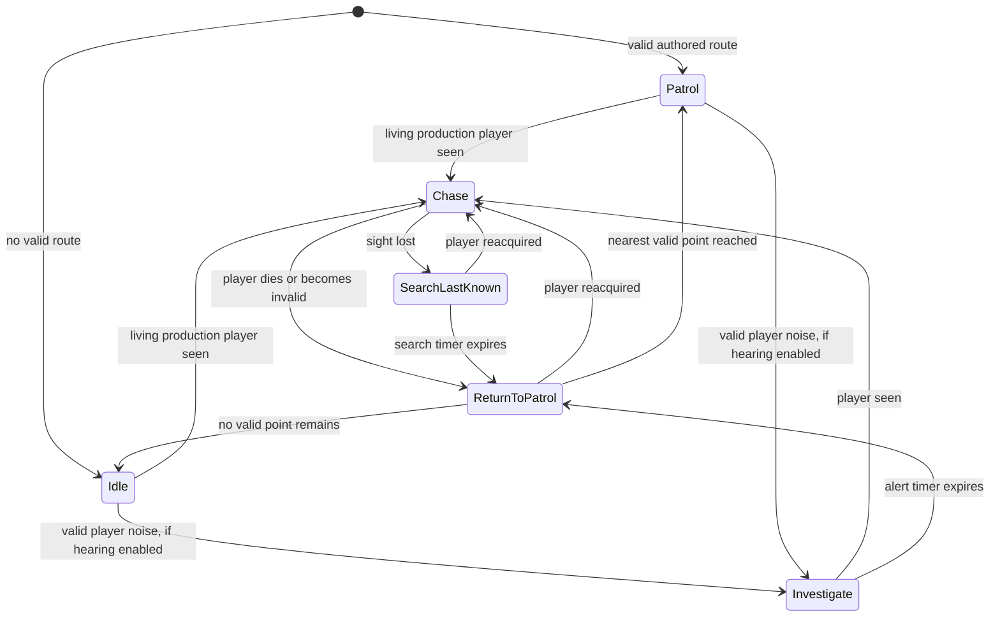

# SOTM Isabel AI Foundation — Phase 1 Report

Date: 2026-08-02  
Project: The Secrets of the Mansion — Chapter 1  
Scope: Detection, patrol, investigation-ready perception, chase, last-known-position search, and patrol recovery only

## Verification status

Implementation is present and both the `SOTM1Editor Win64 Development` and `SOTM1 Win64 Development` targets compile successfully. An earlier PIE session verified the authored Mansion route and the Patrol → Chase → Search Last Known → Patrol cycle. The final post-build PIE/Blueprint verification is **blocked**, not passed: Windows Smart App Control now refuses to load the newly built unsigned `UnrealEditor-SOTM1.dll` (Win32 error 4551; Code Integrity events 3033 and 3077). No Windows security setting was changed.

This report therefore does not claim the complete milestone success criteria. The remaining verification work is listed below.

## 1. Production Isabel asset and controller ownership

- The project does not contain a separate, clearly named production Isabel character asset.
- `/Game/AI/BP_AI` is a shared CruelDoll character shell. It is used once in `Mansion_GameStart` and 33 times in the Forest map `CH1`.
- The 33 Forest instances are untagged and appear to be generic cousin/enemy placements. They were not converted to Isabel.
- The single Mansion instance is now the explicit Phase 1 Isabel test instance:
  - class: `/Game/AI/BP_AI.BP_AI_C`
  - label: `Isabel_Phase1`
  - tags: `SOTM.Isabel`, `SOTM.Isabel.Phase1`
  - controller: `/Script/SOTM1.SOTMIsabelAIController`
  - external actor package: `/Game/__ExternalActors__/Mansion_GameStart/2/7J/J7F5D9HNJI1U6SJ17DTJ12`
- Only this Mansion instance was changed. The shared Blueprint defaults and all 33 Forest instances remain untouched.
- The Mansion instance already auto-spawned/auto-possessed as a placed character. `Auto Possess AI` remains `Placed in World or Spawned`.

## 2. Existing systems reused

- CruelDoll skeletal mesh: `/Game/AI/CruelDoll/Meshes/SK_CruelDoll`
- locomotion AnimBP: `/Game/AI/ABP_AI`
- locomotion BlendSpace: `/Game/AI/AI_BlendSpace1D`
- existing idle, walk, and run animation assets under `/Game/AI/CruelDoll/Animations`
- Unreal Character Movement and navigation path following
- production `BP_MenuSystemCharacter` player pawn
- `USOTMPlayerVitalComponent` and `USOTMPlayerStateSubsystem` for dead/game-over awareness only
- existing Mansion and Forest Recast navigation data

No health, lives, respawn, damage, attack, jump-scare, boss, objective, coin, HUD, or story system was duplicated.

## 3. Broken, duplicated, or unsuitable systems found

- `/Game/AI/BP_AI_Controller` has no AI Perception component. Its graph only starts `/Game/AI/BT_AI`.
- `/Game/AI/BD_AI` contains only `SelfActor` and a `seeingPlayer` Boolean.
- `/Game/AI/BT_AI` directly connects chase to `/Game/AI/BT_Task_AttackPlayer`, so it cannot safely drive a no-combat Phase 1 Isabel.
- `/Game/AI/BP_AI` mixes PawnSensing, chase flags, melee trace/damage, attack montage, jump-scare media, input disabling, fade UI, audio, and level travel in one legacy Event Graph.
- The Mansion Isabel instance's PawnSensing updates were disabled so that legacy detection/attack flow cannot compete with the new controller. The component and Blueprint were not deleted.
- No State Tree exists for this AI stack.
- The Forest contains 33 copies of the generic stack. This is a known future CPU/ownership risk, but no Forest AI was removed or optimized in this phase.

## 4. AI architecture implemented

`ASOTMIsabelAIController` is a modular native controller with no Actor Tick. It uses perception delegates, move-completion events, and one 0.2-second state evaluation timer. Route discovery runs once on possession and path refreshes are throttled.

Implemented states:

1. Idle
2. Patrol
3. Investigate
4. Chase
5. Search Last Known
6. Return to Patrol



Invalid points and failed paths advance through the route. Exhausting every point falls back to Idle instead of recursing, teleporting, or remaining permanently stuck.

## 5. Perception configuration

Default values, all configurable on the controller class:

| Setting | Value |
|---|---:|
| Sight radius | 1800 uu |
| Lose-sight radius | 2200 uu |
| Peripheral half-angle | 70 degrees |
| Sight memory | 1.5 seconds |
| Chase repath interval | 0.5 seconds |
| Chase repath distance threshold | 120 uu |
| Search duration | 6 seconds |
| Search radius | 350 uu |
| Patrol speed | 180 uu/s |
| Investigate speed | 260 uu/s |
| Chase speed | 480 uu/s |

Sight uses Unreal AI Perception and therefore performs visibility/occlusion tests rather than distance-only detection. The controller explicitly registers the production player pawn as a sight stimulus source, then filters stimuli to the first player-controlled production pawn. Dead players and game-over state are rejected through the existing Player Foundation APIs.

Hearing architecture is configured but **disabled by default**. No loud-noise gameplay rule was invented. If later enabled, only a valid living production-player stimulus can enter Investigate.

## 6. Patrol configuration

Reusable actor: `/Script/SOTM1.SOTMIsabelPatrolPoint`

Each point exposes:

- route ID;
- integer order;
- configurable wait duration.

Each controller exposes its route ID and Loop/Back-and-Forth traversal mode. Shared logic contains no Mansion coordinates.

Mansion development route `Isabel_Mansion_Phase1`:

| Point | Order | Wait | Navigation-projected location |
|---|---:|---:|---|
| `Isabel_Patrol_01` | 0 | 2.0 s | X 4025.03, Y 10551.43, Z 40.00 |
| `Isabel_Patrol_02` | 1 | 1.5 s | X 4425.03, Y 10551.43, Z 40.00 |
| `Isabel_Patrol_03` | 2 | 1.5 s | X 4025.03, Y 10951.43, Z 40.00 |

## 7. Navigation findings

- Mansion: one NavMesh bounds volume and one RecastNavMesh were found. All three authored points projected successfully to navigation. PIE reported a valid path, and Isabel moved between the authored positions.
- Forest: seven NavMesh bounds volumes and one RecastNavMesh were found. No second RecastNavMesh was found in the current audit.
- Forest still reports the previously known nearly-zero-scale `BP_item` physics actor warning. It was not changed in this AI phase.
- No doors, stairs, or production corridors were redesigned.
- A Forest Isabel route was not authored because no Forest instance is identified as Isabel; converting one of 33 generic enemies or adding a 34th enemy would invent production ownership and placement.

## 8. Animation findings

- `/Game/AI/ABP_AI` reads movement speed from velocity and feeds the existing locomotion BlendSpace.
- Existing CruelDoll idle, walk, and run assets are available and remain assigned.
- Patrol and chase use distinct movement speeds intended to drive walk and run presentation.
- No attack or jump-scare animation was connected.
- Runtime movement was observed in PIE, but final idle/walk/run visual transition capture remains manual because the rebuilt module is currently blocked by Smart App Control.

## 9. Development-only debugging

In non-Shipping builds the controller provides:

- a world-space debug string above Isabel;
- a line to the last-known player location;
- state-transition logs;
- `DisplayDebug` output compatible with Unreal AI debug display;
- Blueprint-readable getters for current state, target, last-known location, patrol point, visibility, path validity, movement speed, and search time remaining.

Debug drawing and custom canvas output are compiled out with `#if !UE_BUILD_SHIPPING`. The existing Player System Debug HUD was not modified.

## 10. Tests completed and results

| # | Test | Result | Evidence / limitation |
|---:|---|---|---|
| 1 | Starts Idle or Patrol | Pass | PIE state was `Patrol`. |
| 2 | Follows patrol points | Pass | Pawn location changed and current point/path were valid. |
| 3 | Waits at points | Implementation verified; visual check pending | Per-point timers are authored; no final video capture. |
| 4 | Invalid point recovery | Static/compile verified; runtime pending | Final safety guards compile; post-build PIE blocked. |
| 5 | Outside sight range ignored | Pass | Moving player outside range cleared target. |
| 6 | Solid wall blocks sight | Manual confirmation pending | AI Perception sight is used; a controlled wall test was not captured. |
| 7 | Valid sight detects player | Pass | Sight stimulus acquired after explicit source registration. |
| 8 | Transitions to Chase | Pass | Runtime state became `Chase`. |
| 9 | Correct production player | Pass | Target was `BP_MenuSystemCharacter_C_0`. |
| 10 | Ignores unrelated actors | Code-path pass; runtime prop test pending | Filter accepts only first player-controlled pawn. |
| 11 | Stops targeting dead player | Partial pass | Existing Player System killed player; AI reported no target. Active-Chase death should be repeated manually. |
| 12 | Remembers last known location | Pass | LKP retained the final visible player coordinate. |
| 13 | Searches after sight loss | Pass | Runtime state became `SearchLastKnown`. |
| 14 | Reacquires during search | Manual test pending | Transition is implemented but not captured. |
| 15 | Returns after failed search | Pass | After timeout runtime returned to `Patrol` with valid point/path. |
| 16 | Does not remain stuck | Pass for tested cycle | One complete Chase → Search → Patrol cycle terminated normally. |
| 17 | Mansion test-route navigation | Pass | Navigation projection and runtime movement succeeded. |
| 18 | Forest Isabel navigation | Blocked by ownership | No production Isabel/route is identified in Forest. |
| 19 | Idle/walk/run visuals | Manual capture pending | Existing speed-driven animation stack preserved. |
| 20 | Main Menu → Mansion → Forest | Not rerun after final build | No menu/transition asset changed; final Editor module load is blocked. |
| 21 | Player movement/camera/system unchanged | Source-scope pass; final interactive pending | No Player Foundation or player asset was modified. |
| 22 | No new Blueprint compile errors | Not finally verified | No Blueprint asset was edited; Compile All could not run after Smart App Control blocked the module. |
| 23 | No large performance regression | Architecture pass; metric unavailable | No Tick; one 5 Hz timer; one route scan on possess; chase requests throttled. No before/after CPU capture was collected. |

Build verification:

- `SOTM1Editor Win64 Development`: succeeded.
- `SOTM1 Win64 Development`: succeeded.
- No package was created.
- No files were staged or committed.

## 11. Exact manual verification steps still required

After Windows permits the newly compiled project module to load:

1. Open `Mansion_GameStart` and start PIE.
2. Run `showdebug AI` and approach `Isabel_Phase1`.
3. Observe Patrol state, three points, wait intervals, and walk animation.
4. Stand outside 1800 uu; confirm no target.
5. Stand behind a solid wall within 1800 uu; confirm no target.
6. Enter the sight cone with clear line of sight; confirm Chase, correct player target, valid path, and run animation.
7. Break line of sight; confirm LKP, Search, then Return/Patrol after six seconds.
8. Re-enter sight during Search; confirm immediate Chase.
9. With the Development Player Debug Panel, kill the player during active Chase; confirm target clears and no damage is applied by Isabel.
10. Temporarily invalidate one development patrol point in PIE only; confirm another point is selected and restore it before leaving PIE.
11. Compile all production Blueprints and confirm zero errors.
12. Smoke-test Main Menu → New Game → Mansion → Forest and ordinary player movement/camera.

Do not disable Smart App Control casually. Microsoft documents that unknown unsigned binaries can be blocked and that a trusted code-signing certificate is the supported allow path. A project/developer-machine security decision is required outside this milestone.

## 12. Performance observations

- Controller Actor Tick: disabled.
- Patrol-point Actor Tick: disabled.
- State evaluation: one 0.2-second timer per Isabel controller.
- Patrol discovery: one `TActorIterator` scan on possession, not repeated.
- Perception: delegate-driven.
- Chase repath: maximum every 0.5 seconds and only after target movement threshold unless forced by acquisition.
- Search: bounded six-second duration and navigation sampling only while idle.
- The 33 existing Forest enemy stacks were not enabled with this controller and received no new timer/perception cost.
- No CPU timing metric was captured for the new controller; therefore no numeric performance improvement/regression is claimed.

## 13. Remaining blockers for Combat Phase

- Client/map-owner confirmation of the production Forest Isabel instance and intended route.
- Active-Chase player-death test completion.
- Confirmation that CruelDoll is the approved main Isabel visual identity, not only the cousin/enemy look.
- Decide whether the legacy shared `BP_AI` shell should eventually be split into dedicated Isabel and cousin assets. Do not add combat to the shared prototype until ownership is resolved.
- Define attack range, cadence, damage, hit reaction, and Player Foundation API call for Phase 2.
- The legacy `BT_Task_AttackPlayer` and `BP_AI` melee graph must not be reconnected without isolating their jump-scare/level-travel side effects.

## 14. Remaining blockers for Jump Scare Phase

- Client confirmation of death jump-scare trigger rules and reference-video timing.
- Camera/input-lock ownership and restore behavior using existing Player Foundation APIs.
- Selection/approval of the existing media, Level Sequence, audio, fade, and widget assets.
- Separation of cinematic presentation from damage/death state so respawn and game-over remain authoritative.

## 15. Exact files created or modified

Modified:

- `Source/SOTM1/SOTM1.Build.cs`
- `Content/__ExternalActors__/Mansion_GameStart/2/7J/J7F5D9HNJI1U6SJ17DTJ12.uasset` — Mansion Isabel instance

Created:

- `Source/SOTM1/Public/AI/SOTMIsabelAITypes.h`
- `Source/SOTM1/Public/AI/SOTMIsabelAIController.h`
- `Source/SOTM1/Private/AI/SOTMIsabelAIController.cpp`
- `Source/SOTM1/Public/AI/SOTMIsabelPatrolPoint.h`
- `Source/SOTM1/Private/AI/SOTMIsabelPatrolPoint.cpp`
- `Content/__ExternalActors__/Mansion_GameStart/0/1T/Z0JUQJUX0WI1TEEU59F108.uasset` — `Isabel_Patrol_01`
- `Content/__ExternalActors__/Mansion_GameStart/9/5S/486H3XZGH75OLBD9NH44YM.uasset` — `Isabel_Patrol_02`
- `Content/__ExternalActors__/Mansion_GameStart/1/0S/X3UJZQNR4D7PITLDFPAP7N.uasset` — `Isabel_Patrol_03`
- `ProjectDocs/SOTM_Isabel_AI_Phase1_Report.md`

## 16. Exact Git allowlist

Only the following paths belong to this milestone:

```text
Source/SOTM1/SOTM1.Build.cs
Source/SOTM1/Public/AI/SOTMIsabelAITypes.h
Source/SOTM1/Public/AI/SOTMIsabelAIController.h
Source/SOTM1/Private/AI/SOTMIsabelAIController.cpp
Source/SOTM1/Public/AI/SOTMIsabelPatrolPoint.h
Source/SOTM1/Private/AI/SOTMIsabelPatrolPoint.cpp
Content/__ExternalActors__/Mansion_GameStart/2/7J/J7F5D9HNJI1U6SJ17DTJ12.uasset
Content/__ExternalActors__/Mansion_GameStart/0/1T/Z0JUQJUX0WI1TEEU59F108.uasset
Content/__ExternalActors__/Mansion_GameStart/9/5S/486H3XZGH75OLBD9NH44YM.uasset
Content/__ExternalActors__/Mansion_GameStart/1/0S/X3UJZQNR4D7PITLDFPAP7N.uasset
ProjectDocs/SOTM_Isabel_AI_Phase1_Report.md
```

Generated `Binaries`, `Intermediate`, `Saved`, Derived Data Cache, logs, and temporary MCP Python files must not be committed.

## 17. Suggested commit message

```text
Add Isabel AI Phase 1 perception and patrol foundation
```
