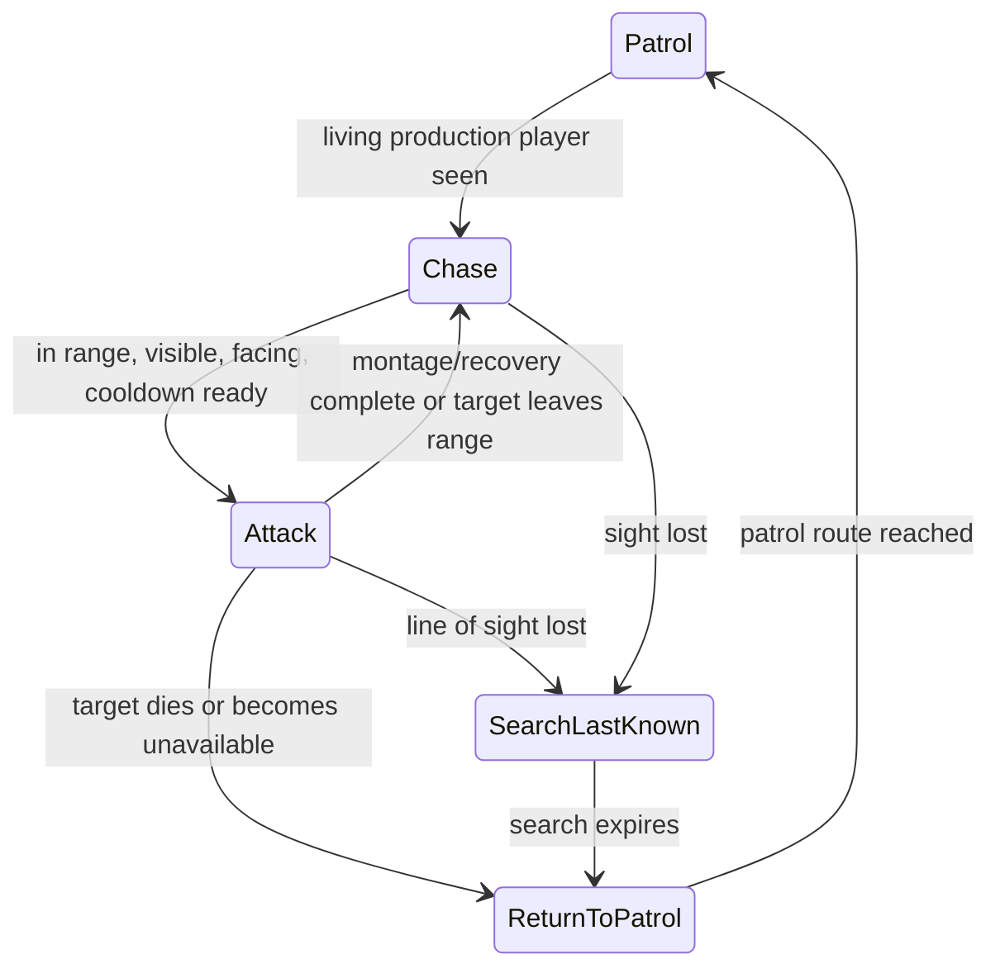

# SOTM Isabel AI — Phase 2 Report

Date: 2026-08-04  
Scope: normal melee attack, attack animation, Player System damage integration, cooldown, death/respawn handling, and development diagnostics only

## Verification status

The Phase 2 attack implementation is complete and the final `SOTM1Editor Win64 Development` target builds successfully. Focused Mansion PIE tests passed for patrol, perception, chase, attack, animation playback, notify-timed damage, cooldown, occlusion, Player System invulnerability, death, one-life consumption, respawn, Game Over, search, and return to patrol.

The report does **not** claim two items that automation could not fully establish:

- final artistic approval of the exact attack impact pose/timing still requires a human viewing the animation at normal speed;
- the actual Main Menu **New Game** click and Mansion overlap transition were not rerun successfully by automation. The three production maps each load independently, and Mansion/Forest spawn the production player, but the attempted automated runtime `open` commands remained in the PIE Main Menu world. No menu, map, or transition asset was changed in Phase 2.

No package was created. No file was staged or committed.

## 1. Existing Phase 1 architecture reused

Phase 2 extends `ASOTMIsabelAIController`; it does not introduce another AI controller, Behavior Tree, or parallel combat state machine.

Reused Phase 1 behavior:

- `Idle`, `Patrol`, `Investigate`, `Chase`, `SearchLastKnown`, and `ReturnToPatrol` states;
- AI Perception sight and production-player filtering;
- living-player validation through `USOTMPlayerVitalComponent` and `USOTMPlayerStateSubsystem`;
- authored Mansion route `Isabel_Mansion_Phase1`;
- throttled 0.2-second state evaluation timer and 0.5-second chase repathing;
- no Actor Event Tick;
- the single Mansion `Isabel_Phase1` instance only. The 33 Forest enemy stacks remain untouched.

The new flow is:



## 2. Production Isabel and animation assets used

- production character shell: `/Game/AI/BP_AI`
- Mansion production/test instance: `Isabel_Phase1`
- skeletal mesh: `/Game/AI/CruelDoll/Meshes/SK_CruelDoll`
- locomotion AnimBP: `/Game/AI/ABP_AI`
- locomotion BlendSpace: `/Game/AI/AI_BlendSpace1D`
- source normal attack sequence: `/Game/AI/AS_CruelDoll_Attack03`
- source montage inspected: `/Game/AI/AS_CruelDoll_Attack03_Montage`
- isolated Phase 2 montage: `/Game/AI/AM_Isabel_NormalAttack_Phase2`

Attack03 is 2.033 seconds, uses the correct CruelDoll skeleton, and is in-place rather than root-motion driven. The AnimBP already contains a Default Slot after locomotion, so no AnimBP graph change was required.

The legacy `/Game/AI/BP_AI` attack was deliberately not reused. Its old `Attack Player` event starts a sphere trace immediately after montage playback and mixes combat with legacy jump-scare, audio, fade, input, and travel logic. The Phase 2 montage is a duplicate so its notify does not change that shared legacy path.

## 3. Attack state implementation

`Attack` was added to the existing enum and controller switch.

At entry Isabel:

1. validates the current target as the living first production player;
2. requires AI Perception sight and a controller line-of-sight check;
3. requires the player within `AttackRange`;
4. stops navigation and character movement;
5. temporarily disables orient-to-movement rotation;
6. faces the player before playing the montage;
7. starts one montage and one cooldown;
8. prevents overlapping attacks.

During Attack, the existing 5 Hz evaluation timer only checks invalid target, lost LOS, and the range exit margin. It does not restart the montage or apply damage. If the target leaves `AttackRange + AttackExitMargin`, the montage is safely interrupted and Chase resumes. Animation delegates are unbound before an explicit montage stop to prevent stale completion callbacks.

When the montage and optional recovery finish, rotation settings and chase speed are restored. If the player remains valid and visible, Isabel returns to Chase; if still in range after cooldown, the next normal attack may begin.

## 4. Configurable attack values

All values are instance/class-editable and remain temporary balancing defaults:

| Setting | Default |
|---|---:|
| Attack range | 150 uu |
| Attack exit margin | 40 uu |
| Attack cooldown | 2.4 s |
| Attack damage | 25 |
| Facing tolerance | 18 degrees |
| Optional pre-montage wind-up | 0.0 s |
| Optional post-montage recovery | 0.15 s |
| Normal attack montage | `/Game/AI/AM_Isabel_NormalAttack_Phase2` |

Cooldown begins when the montage successfully starts. The observed attack cadence was bounded by the 2.033-second montage plus recovery and never replayed every frame.

## 5. Attack-animation integration

`AM_Isabel_NormalAttack_Phase2` contains one `USOTMIsabelAttackImpactNotify` event. The notify delegates to the possessing `ASOTMIsabelAIController`; it contains no health, life, death, or respawn implementation.

Animation motion sampling showed the striking right hand reaching its apex near 0.70 seconds and completing its fast downward motion near 0.90 seconds. The notify was authored at 0.90 seconds. Runtime logs placed health damage approximately one second after entering Attack, and a game-viewport screenshot captured Isabel in the normal attack presentation:

`Saved/Screenshots/WindowsEditor/SOTM_Phase2_Attack_PIE.png` (generated evidence; do not commit)

The animation played once per attack and returned to locomotion. Final aesthetic approval of the exact contact frame remains a manual/client review item.

## 6. Damage timing method

Damage is applied only by the dedicated montage notify. The controller sets `bDamageAppliedThisAttack` before impact validation, so duplicated notify callbacks or delegates cannot apply damage twice.

At impact it revalidates:

- living production player;
- attack distance;
- line of sight;
- facing tolerance.

A miss or invalid impact consumes that attack without damage. The damage-consumed flag resets only when a new attack begins.

## 7. Player System integration

The notify path calls:

`USOTMPlayerBlueprintLibrary::ApplyPlayerDamage(...)`

This uses Unreal's normal `UGameplayStatics::ApplyDamage` route. Phase 2 never writes current health, legacy HP, lives, death state, checkpoint state, respawn state, or Game Over state.

The Player System remains authoritative for:

- health reduction;
- temporary invulnerability;
- death;
- one-life decrement;
- respawn and checkpoint restoration;
- Game Over and Retry ownership.

An integration test found that Unreal's generic `ApplyDamage` return can be positive even when the Vital Component ignores damage due to invulnerability. Success/debug accounting was therefore corrected to compare authoritative Vital Component health before and after the approved damage call. With invulnerability active, health remained 100, the attack impact was consumed once, and `LastSuccessfulDamageTime` remained unset.

## 8. Death and respawn behavior

When the target dies or becomes unavailable, Isabel:

- aborts and stops the current montage;
- clears wind-up/recovery timers;
- restores locomotion rotation mode;
- stops navigation;
- clears the target;
- returns toward patrol;
- does not implement or call separate respawn logic.

Focused results:

- two-life test: `2 → 1` lives, health restored to 100 at the existing checkpoint, Player Dead false, Game Over false, Isabel target null and Attack false;
- one-life test: `1 → 0` lives, health 0, Player Dead true, Game Over true, Isabel target null and Attack false;
- after respawn, the production pawn could be reacquired through normal sight once it became valid again;
- Player System invulnerability prevented damage without causing a duplicate impact.

## 9. Debug tools added

Existing non-Shipping world/canvas debugging now exposes:

- current AI state;
- current target;
- distance to target;
- attack range;
- perception/controller LOS;
- facing status;
- can-attack status;
- attack-in-progress status;
- damage-consumed status;
- cooldown remaining;
- last authoritative successful-damage time;
- player dead/respawning/Game Over availability status.

Debug drawing remains inside `#if !UE_BUILD_SHIPPING`. Public read-only getters are available for Blueprint/editor inspection, but no Shipping debug widget or panel was added. The Player System Debug HUD was not modified.

## 10. Tests completed and results

| # | Test | Result | Evidence |
|---:|---|---|---|
| 1 | Patrol before detection | Pass | Clean PIE start: Patrol, valid point/path, 180 uu/s. |
| 2 | Detect/chase production player | Pass | Target was `BP_MenuSystemCharacter_C_0`; state Chase. |
| 3 | Attack only in range | Pass | Attack entered at approximately 126 uu with 150 uu range. |
| 4 | No attack through geometry | Pass | At an 800 uu occluded Mansion position: direct LOS false, target null, Patrol, health 100. |
| 5 | Stops before attack | Pass | Navigation stopped and movement speed set to zero by Attack entry; no visible sliding in captured frame. |
| 6 | Faces player | Pass | Runtime facing getter true during Attack; explicit yaw alignment occurs before montage. |
| 7 | Montage once | Pass | One montage start per Attack state; no per-frame restart. |
| 8 | Notify near impact | Functional pass; artistic review pending | Notify at 0.90 s; damage logged about one second after Attack entry. |
| 9 | One damage per attack | Pass | One 25-damage log per attack; impact flag consumed once. |
| 10 | Player health through Player System | Pass | 100 → 75 → 50 → 25 → death in normal tests. |
| 11 | Invulnerability | Pass | Health stayed 100; consumed true; last successful damage stayed `-1`. |
| 12 | Cooldown | Pass | Repeated attacks followed montage/cooldown cadence, not frame rate. |
| 13 | Repeated attack in range | Pass | Re-entered Attack after completion/cooldown. |
| 14 | Escape range | Pass | Teleporting from active Attack to 2828 uu caused abort; health unchanged for that impact. |
| 15 | Re-enter range | Pass | Chase reacquired and attacked when returned to clear range. |
| 16 | Stop on death | Pass | Target null and Attack false after death. |
| 17 | Exactly one life consumed | Pass | Focused 2 → 1 test. |
| 18 | Existing respawn | Pass | Health 100 at the existing player checkpoint; no AI respawn code. |
| 19 | No attack during unavailable state | Pass | Dead/Game Over target cleared; player-unavailable debug true. |
| 20 | Reacquire after respawn | Pass | Normal perception reacquired the valid respawned production pawn. |
| 21 | Game Over | Pass | Focused 1 → 0 test reached authoritative Game Over. |
| 22 | Search/Return regression | Pass | Chase → Search → ReturnToPatrol → Patrol with valid path. |
| 23 | Main Menu → Mansion → Forest | Partial | Each map loaded independently in PIE; Mansion and CH1 spawned `BP_MenuSystemCharacter`. Actual menu click/overlap travel was not completed by automation. |
| 24 | Player movement/camera/save/checkpoint unchanged | Source-scope pass | No player, input, save, checkpoint, camera, map, or UI asset changed. |
| 25 | Compile errors | Pass for affected production assets | `BP_AI`, `ABP_AI`, and `BP_MenuSystemCharacter` compiled; Editor C++ target succeeded. |
| 26 | Performance regression | Architectural pass; no numeric claim | No Tick or per-frame actor scans were added. No before/after CPU capture was collected. |

Direct Forest smoke result:

- map: `CH1`;
- production player: `BP_MenuSystemCharacter_C_0`;
- pawn count: 34;
- native Phase 2 Isabel controllers: 0, confirming the 33 generic Forest enemies were not altered.

## 11. Manual tests still required

1. View Attack03 at normal speed and approve or adjust the 0.90-second contact frame.
2. Repeat a normal walk-in encounter without test teleporting and confirm presentation at several approach angles.
3. Click **New Game** in the production Main Menu and walk through the real Mansion-to-Forest overlap. Automation loaded all maps independently but did not complete these UI/overlap transitions.
4. Confirm player movement, camera, save, and checkpoint interactively during that end-to-end route.
5. Optionally capture a client-facing short video. The generated PIE screenshot is under `Saved` and is intentionally excluded from Git.
6. Collect an Unreal Insights comparison if a numeric Phase 1-versus-Phase 2 performance claim is required. None is estimated here.

## 12. Smart App Control and environment blockers

Smart App Control did not block this Phase 2 build or the new `UnrealEditor-SOTM1.dll`. No Windows security setting was changed.

One sandbox-only build attempt initially failed because UnrealBuildTool could not write its AppData XML cache; the same Editor build then succeeded with the narrowly scoped build permission. This was not a project error.

The Main Menu PIE world rendered its background/character intro in captured game-viewport frames, but the New Game UI was not available to the automation during the observation window. The attempted PIE console travel commands reported execution but left the active world on `Main_Menu_Map`; therefore actual transition success is not claimed from those commands.

## 13. Remaining work for Phase 3 — Cinematic Jump Scare

Phase 3 has not started. It still requires explicit authorization and decisions for:

- exact cinematic/death trigger rule;
- approved camera and kill animation;
- Player System input-lock ownership and restoration;
- camera restoration after interruption;
- jump-scare audio/VFX/media selection;
- clean separation from normal damage, death, respawn, and Game Over;
- final client timing/reference-video review.

Normal Attack must remain independent of the future cinematic sequence.

## 14. Exact files created or modified

Modified:

- `Source/SOTM1/Public/AI/SOTMIsabelAITypes.h`
- `Source/SOTM1/Public/AI/SOTMIsabelAIController.h`
- `Source/SOTM1/Private/AI/SOTMIsabelAIController.cpp`

Created:

- `Source/SOTM1/Public/AI/SOTMIsabelAttackImpactNotify.h`
- `Source/SOTM1/Private/AI/SOTMIsabelAttackImpactNotify.cpp`
- `Content/AI/AM_Isabel_NormalAttack_Phase2.uasset`
- `ProjectDocs/SOTM_Isabel_AI_Phase2_Report.md`

No map, external actor, Player System, player Blueprint, AnimBP, legacy AI Blueprint, Behavior Tree, Forest enemy, menu, save, objective, coin, boss, Timmy, or cutscene asset was modified.

Generated `Binaries`, `Intermediate`, `Saved`, screenshots, logs, Derived Data Cache, and MCP temp files must not be committed.

## 15. Exact Git allowlist

```text
Source/SOTM1/Public/AI/SOTMIsabelAITypes.h
Source/SOTM1/Public/AI/SOTMIsabelAIController.h
Source/SOTM1/Private/AI/SOTMIsabelAIController.cpp
Source/SOTM1/Public/AI/SOTMIsabelAttackImpactNotify.h
Source/SOTM1/Private/AI/SOTMIsabelAttackImpactNotify.cpp
Content/AI/AM_Isabel_NormalAttack_Phase2.uasset
ProjectDocs/SOTM_Isabel_AI_Phase2_Report.md
```

## 16. Suggested commit title and description

Title:

```text
Add Isabel AI Phase 2 normal attack integration
```

Description:

```text
- extend the Phase 1 Isabel state machine with a normal Attack state
- add configurable range, cooldown, damage, facing, wind-up and recovery
- add an isolated Attack03 montage with notify-timed impact
- route damage through the existing Player System API
- stop attacks on LOS loss, escape, death, respawn and Game Over
- expose non-Shipping attack diagnostics
- document focused PIE and compile verification
```

## 17. Short client update

Isabel's Phase 2 normal attack is implemented on top of the existing Phase 1 AI. She now stops and faces the player in range, plays the existing CruelDoll normal attack once, applies one notify-timed 25-damage hit through the completed Player System, respects cooldown and walls, resumes Chase when appropriate, and stops safely for death, respawn, or Game Over. Patrol/Search/Return behavior remains functional, and the 33 Forest enemies were not changed. The final Editor build and affected Blueprints compile successfully. Final human approval of the contact frame and an end-to-end New Game/portal smoke test remain before calling all presentation verification closed.
